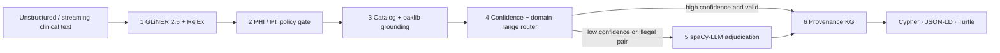
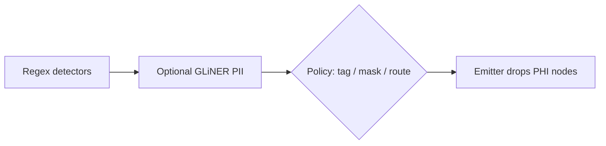

# Clinical-GLiNER-KG

Cascaded clinical extraction plane:

**GLiNER 2.5 → PHI gate → oaklib (local ontologies) → spaCy-LLM only when needed → provenance-aware KG**

[](https://github.com/YPCC/clinical-gliner-kg/actions)
[](https://www.python.org/downloads/)
[](LICENSE)

**Docs:** [overview](docs/overview.md) · [configuration](docs/configuration.md) · [architecture](docs/architecture.md) · [oaklib (local, no API)](docs/oaklib-grounding.md) · [evaluation](docs/evaluation.md) · [bibliography](docs/bibliography.md) · [infographics](docs/infographics.md) · [LinkedIn draft](docs/linkedin-post.md)

---

1. **GLiNER turns clinical text into structured entities + relationships** — without sending every document to an LLM.
2. **Use it as a fast, high-recall extraction layer** for NER, PHI/PII, streaming events, and KG triples.
3. **Ground outputs with oaklib on local OBO / SQLite files** (plus a SNOMED / RxNorm / LOINC catalog). **No ontology API key is required.**
4. **Escalate only ambiguous cases to an LLM** — improving accuracy while controlling latency, cost, and risk.
5. **Result:** a continuously enriched, provenance-aware Healthcare Knowledge Graph for RAG, analytics, and AI agents.

Inspired by [GLiNER (NAACL 2024)](https://aclanthology.org/2024.naacl-long.300/), [GLiNER 2.5](https://github.com/fastino-ai/GLiNER2), [oaklib](https://incatools.github.io/ontology-access-kit/), [spaCy-LLM](https://github.com/explosion/spacy-llm), and the open NCBI Disease / BC5CDR corpora. Full reference list: [docs/bibliography.md](docs/bibliography.md).

---

## Why a cascade, not “another NER model”

GLiNER 2.5 (Fastino boundary architecture) predicts entity spans directly, supports long context, joint entity–relation decoding, PII checkpoints, and CPU/ONNX-style deployment. That makes it a **lightweight semantic sensing tier** between raw notes / FHIR events and expensive domain models or LLMs.




Reference sentence:

> Patient with type 2 diabetes was started on metformin because HbA1c increased to 8.2%.

| Subject | Relation | Object | Grounding |
|---|---|---|---|
| Patient | `HAS_CONDITION` | type 2 diabetes | SNOMED CT `44054006` |
| Patient | `TAKES` | metformin | RxNorm `6809` |
| metformin | `TREATS` | type 2 diabetes | allowed domain-range |
| HbA1c | `HAS_VALUE` | 8.2% | LOINC `4548-4` |

A spurious candidate such as `metformin HAS_ANATOMICAL_SITE kidney` is **rejected** by ontology rules and never written to the graph.

---

## oaklib runs locally (no API key)

Grounding uses **[oaklib](https://incatools.github.io/ontology-access-kit/)** (Ontology Access Kit). The default path is **offline**:

- Bundled `simpleobo:data/ontologies/mini_clinical.obo` — no download, no key
- Optional `sqlite:obo:mondo` / `sqlite:obo:chebi` — **local SQLite after one Foundry fetch** into the pystow cache
- Optional `simpleobo:/your/mondo.obo` or `sqlite:/your/chebi.db` — files you already have
- OLS / BioPortal adapters exist in oaklib but are **not** the default (they send spans off-box and BioPortal needs `BIOPORTAL_API_KEY`)

```python
from oaklib import get_adapter
adapter = get_adapter("simpleobo:data/ontologies/mini_clinical.obo")
for ann in adapter.annotate_text("type 2 diabetes"):
    print(ann.object_id, ann.object_label)  # MONDO:0005148
```

```bash
export OAK_EAGER=1
export OAK_ADAPTERS=sqlite:obo:mondo,sqlite:obo:chebi
```

You still need **the ontology files** (or the one-time `sqlite:obo:` snapshot). oaklib is not a hosted terminology service.

Read: [docs/oaklib-grounding.md](docs/oaklib-grounding.md) · [OAK introduction](https://incatools.github.io/ontology-access-kit/introduction.html) · [FAQ: local files](https://incatools.github.io/ontology-access-kit/faq/general.html) · [SQLite adapter](https://incatools.github.io/ontology-access-kit/packages/implementations/sqldb.html) · [GitHub](https://github.com/INCATools/ontology-access-kit)

---

## Repository map

```
clinical-gliner-kg/
├── docs/                   how to use the config, architecture, oaklib, bibliography
├── config/                 pipeline.yaml + API-key example overlay
├── src/clinical_gliner_kg/
│   ├── backends/           GLiNER 2.5 · gliner-spacy · heuristic fallback
│   ├── components/         PHI gate · oaklib grounder · ontology · LLM
│   ├── graph/              Cypher / JSON-LD / Turtle emitter
│   └── pipeline.py
├── data/
│   ├── synthetic/          runnable gold notes + PHI examples
│   ├── ontologies/         mini OBO used by oaklib simpleobo
│   └── catalogs/           slice of YPCC/medical-data (open vs DUA)
├── examples/               demos and benchmarks
└── tests/                  no-weight unit tests
```

---

## Install

Minimal path (heuristic backend, tests, demos — no model download):

```bash
git clone https://github.com/YPCC/clinical-gliner-kg.git
cd clinical-gliner-kg
python -m venv .venv
source .venv/bin/activate
pip install -e ".[dev]"
pytest -q
```

Full showcase stack (GLiNER 2.5, gliner-spacy, spaCy-LLM, oaklib, RDF):

```bash
pip install -e ".[all]"
# or
pip install -r requirements-full.txt
```

## How to use the config file

Modes live in YAML. **Keys live in the environment.** Full walkthrough: [docs/configuration.md](docs/configuration.md).

```
CLI flag → env var → config/pipeline.yaml → default
```

### Local (default, no keys)

[`config/pipeline.yaml`](config/pipeline.yaml) already does this:

```yaml
gliner:  { mode: local }       # weights on this box
oaklib:  { mode: local }       # bundled mini OBO, no API
llm:     { provider: none, enable: false }
```

```bash
clinical-gliner --config config/pipeline.yaml --print-config
python examples/run_pipeline.py --config config/pipeline.yaml --backend heuristic
```

### API-key example (Pioneer + OpenAI + BioPortal)

Copy the overlay, put secrets in `.env`, never in YAML.

1. YAML — [`config/pipeline.api-keys.example.yaml`](config/pipeline.api-keys.example.yaml) (committed, **no secrets**):

```yaml
backend: gliner25
gliner:
  mode: pioneer                 # Fastino hosted GLiNER
  pioneer:
    token_env: PIONEER_API_KEY  # name of the env var, not the key
oaklib:
  mode: bioportal
  bioportal:
    token_env: BIOPORTAL_API_KEY
llm:
  provider: openai
  enable: true
  openai:
    model: gpt-4o-mini
    token_env: OPENAI_API_KEY
```

2. `.env` — the actual keys:

```bash
cp config/pipeline.api-keys.example.yaml config/pipeline.local.yaml
cp .env.example .env
```

```bash
PIONEER_API_KEY=pk_live_replace_me     # https://docs.pioneer.ai/authentication
OPENAI_API_KEY=sk-replace_me           # https://platform.openai.com/api-keys
BIOPORTAL_API_KEY=replace_me           # https://bioportal.bioontology.org/account
```

3. Run:

```bash
set -a && source .env && set +a
clinical-gliner --config config/pipeline.local.yaml --print-config
python examples/run_pipeline.py --config config/pipeline.local.yaml --backend gliner25
```

`--print-config` reports only whether each secret is *set*, never the value.

Hugging Face instead of Pioneer: `gliner.mode: huggingface_api` and `HF_TOKEN`.

**Google Gemini API key** (not Vertex ADC):

```yaml
llm:
  provider: google
  enable: true
  google:
    model: gemini-2.0-flash
    token_env: GOOGLE_API_KEY          # or GEMINI_API_KEY
```

```bash
cp config/pipeline.google-api-key.example.yaml config/pipeline.local.yaml
export GOOGLE_API_KEY=AIza-replace_me   # https://aistudio.google.com/apikey
```

**Any OpenAI-compatible endpoint** (Groq, vLLM, Ollama, Together, LiteLLM):

```yaml
llm:
  provider: openai_compat
  enable: true
  openai_compat:
    model: llama-3.1-70b-versatile
    token_env: OPENAI_API_KEY
    base_url: https://api.groq.com/openai/v1
```

Vertex remains ADC (`gcloud auth application-default login`), not an API key. Full tables: [docs/configuration.md](docs/configuration.md).

Copy `.env.example` for the full list of secret names. oaklib `mode: local` does **not** need keys.

| Extra | What it enables |
|---|---|
| `gliner2` | Fastino `AutoExtractor` / `JointIE` on `fastino/gliner2.5-small-v1` (default) or `base` / `multi` |
| `gliner` | Classic `gliner` + spaCy factory `gliner_spacy` |
| `llm` | `spacy-llm` NER.v3 adjudication when `OPENAI_API_KEY` is set |
| `oak` | oaklib grounding (`simpleobo:` bundled mini ontology; `sqlite:obo:mondo` when `OAK_EAGER=1`) |
| `datasets` | NCBI Disease / BC5CDR downloaders |

Backend selection (`--backend` or `CLINICAL_GLINER_BACKEND`):

- `auto` — GLiNER 2.5 if installed, else gliner-spacy, else heuristic
- `gliner25` — Fastino GLiNER 2.5
- `gliner_spacy` — spaCy component wrapping urchade GLiNER
- `heuristic` — lexicon / pattern fallback used by CI

---

## Run

```bash
python examples/run_pipeline.py --config config/pipeline.yaml --backend heuristic
python examples/run_pipeline.py --config config/pipeline.yaml --backend heuristic --all-notes
python examples/run_phi_benchmark.py
python examples/run_kg_demo.py --config config/pipeline.yaml --outdir outputs/kg
python examples/run_architecture_spike.py --config config/pipeline.yaml --backend heuristic
python examples/list_open_datasets.py
clinical-gliner --config config/pipeline.yaml \
  "Patient with type 2 diabetes was started on metformin because HbA1c increased to 8.2%."
```

After installing the full stack:

```bash
python examples/run_pipeline.py --backend gliner25
python examples/run_pipeline.py --backend gliner_spacy
python examples/run_phi_benchmark.py --gliner-pii
python examples/run_literature_benchmark.py --backend gliner25 --limit 30
```

---

## Live GLiNER 2.5 spike (CPU)

`fastino/gliner2.5-small-v1`, 30 test documents/corpus, exact-span F1 after hyphen/space normalization. Details: [docs/evaluation.md](docs/evaluation.md).

| Corpus | N | Entity P / R / F1 | Rel F1 | Ont. pass | Linked | P95 | docs/s | Planning $ / 100k |
|---|---|---|---|---|---|---|---|---|
| NCBI Disease | 30 | 0.22 / 0.35 / 0.27 | n/a | 1.00 | 0.02 | 0.21 s | 6.1 | $41.81 * |
| BC5CDR | 30 | 0.55 / 0.43 / 0.48 | 0.00 † | 1.00 | 0.04 | 0.62 s | 2.4 | $4.66 |
| Synthetic PHI | 5 notes | — | — | — | — | — | — | recall 0.91, over-redaction 0.00 |

\* NCBI planning cost is dominated by a 3% escalation × $0.012 fee. Local compute only is about $1.81 / 100k at $0.40/CPU-hour.  
† Zero-shot CID RelEx on 2.5-small did not recover gold pairs on this slice.

This is a generalist 74M encoder used zero-shot, not a BioBERT number. Next levers: `gliner2.5-base-v1`, biomedical fine-tune, document-level NCBI reconstruction, and `sqlite:obo:mondo`.


---

## Benchmarks and data policy

This repo **does not ship n2c2, i2b2, or MIMIC notes**. See [docs/data-policy.md](docs/data-policy.md) and [YPCC/medical-data](https://github.com/YPCC/medical-data).

`examples/run_architecture_spike.py` measures **live** precision/recall on the bundled gold set. The all-LLM vs GLiNER vs cascade table is an **operations planning matrix**, not a vendor invoice.

---

## PHI / PII path



---

## Architecture notes

GLiNER 2.5 uses a boundary decoder rather than enumerating bounded candidate spans, which is why long-span clinical entities and long notes are in scope. Joint IE (`gliner2.joint_ie.JointIE`) is used when the checkpoint exposes it; otherwise entity extraction and `extract_relations` run as two calls on the same `AutoExtractor`.

spaCy remains the orchestration surface: blank `en` pipeline, `gliner_spacy` factory for classic checkpoints, `spacy-llm` `NER.v3` only on the escalation branch.

This is a reference implementation for a technical spike, not a certified medical device and not a HIPAA compliance program.

---

## License

Apache 2.0. Model weights keep their upstream licenses (GLiNER / Fastino Apache 2.0 at time of writing — verify before redistribution). Cite the [bibliography](docs/bibliography.md) if you reuse the cascade in a paper.
