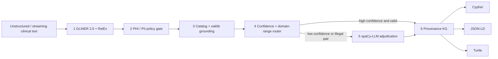
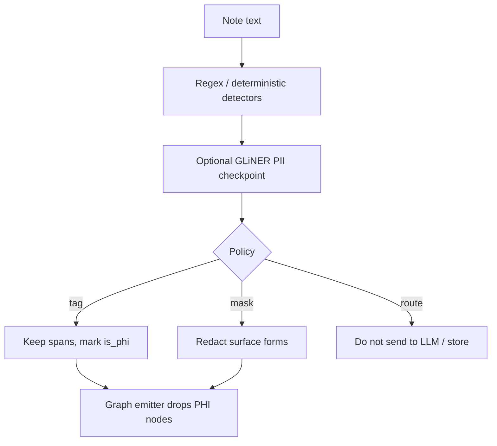

# Architecture

GLiNER 2.5 is the sensing tier. oaklib is the semantics tier. spaCy-LLM is the exception tier.

## Pipeline (mermaid)

## PHI path

The emitter never writes PHI nodes or `REJECTED` relations into Cypher or Turtle.

## Reference sentence

> Patient with type 2 diabetes was started on metformin because HbA1c increased to 8.2%.

| Subject | Relation | Object | Grounding |
|---|---|---|---|
| Patient | `HAS_CONDITION` | type 2 diabetes | SNOMED CT `44054006` / MONDO `0005148` |
| Patient | `TAKES` | metformin | RxNorm `6809` |
| metformin | `TREATS` | type 2 diabetes | allowed domain-range |
| HbA1c | `HAS_VALUE` | 8.2% | LOINC `4548-4` |

`metformin HAS_ANATOMICAL_SITE kidney` is rejected by ontology rules.

## Provenance on every assertion

- source document id and character offsets
- extracting backend / checkpoint name
- confidence
- terminology system + code + linker method (`catalog` or `oaklib-annotate`)
- validation status: `VALIDATED` · `ESCALATED_TO_LLM` · `ADJUDICATED` · `REJECTED`

## Code map

| Stage | Module |
|---|---|
| Backends | `src/clinical_gliner_kg/backends/` |
| PHI | `src/clinical_gliner_kg/components/phi_gate.py` |
| oaklib | `src/clinical_gliner_kg/components/oak_grounder.py` |
| Domain-range | `src/clinical_gliner_kg/components/ontology_linker.py` |
| LLM | `src/clinical_gliner_kg/components/llm_adjudicator.py` |
| Graph | `src/clinical_gliner_kg/graph/emitter.py` |
| Orchestration | `src/clinical_gliner_kg/pipeline.py` |
