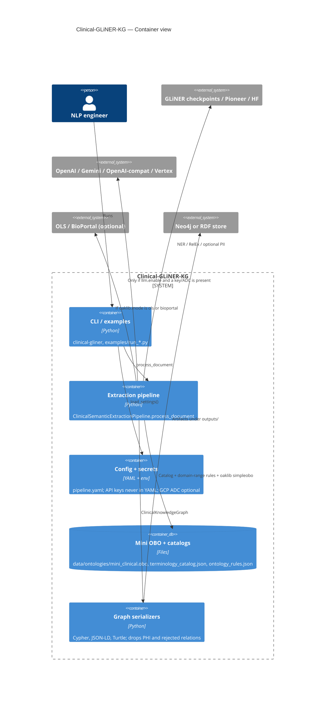

# C4 Level 2 — Container

Deployable / process-level pieces inside Clinical-GLiNER-KG. Today this is **one Python process**. The containers below are logical, matching `src/clinical_gliner_kg/`.

## What is *not* a container yet

| Missing | Why it is listed in next-steps |
|---|---|
| Stream adapter | No Kafka / Pub/Sub / FHIR Subscription worker |
| Review UI | `NEEDS_REVIEW` is a status, not a queue |
| Terminology service | oaklib files, not a hosted CTS |
| Graph database | Serializers only; you load Cypher/Turtle yourself |
