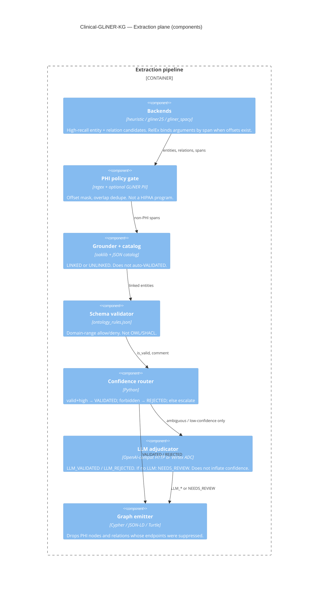
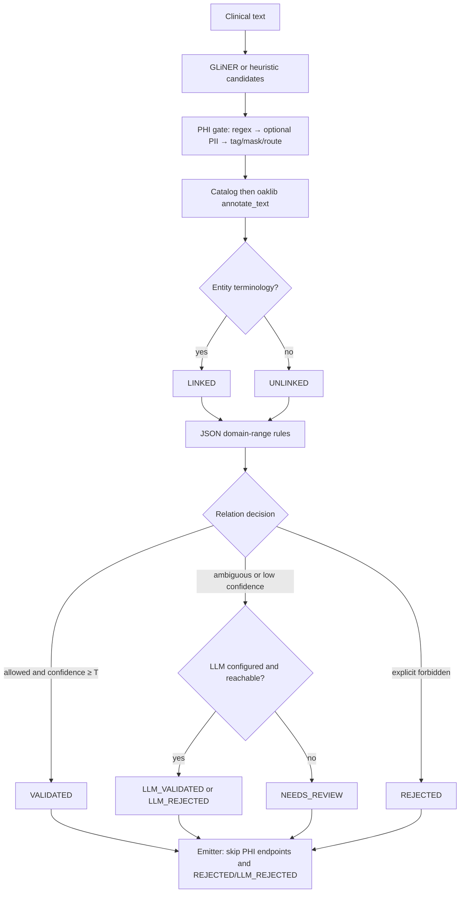

# C4 Level 3 — System (extraction plane components)

Component view of the Python pipeline. This is the “system internals” diagram.

Statuses in **bold** are what the code writes today (`ValidationStatus`).

## Implemented cascade (honest)

## Not in this diagram yet

- SHACL / OWL subclass inference (schema rules only)
- Assertion-level PROV graph with terminology version
- Stream envelope, idempotent upsert/retract
- Longitudinal entity resolution / coreference
