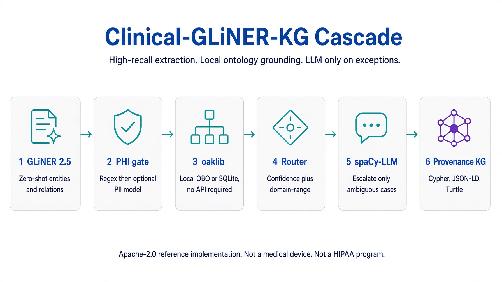
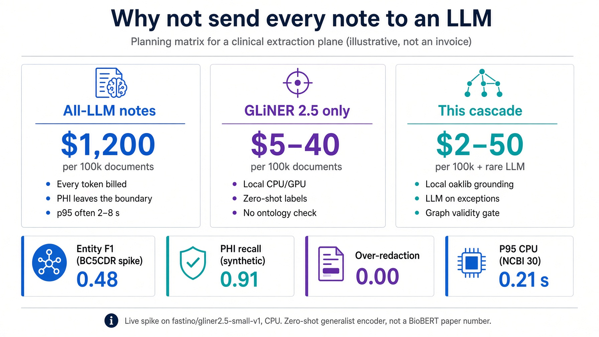

# Infographics

Shareable visuals for talks, README, and LinkedIn. Source files are under `docs/images/`. Both are consulting-style (white, blue / teal / purple) and are **not** screenshots of a live dashboard.

## 1. Cascade

Six stages: GLiNER 2.5 → PHI gate → oaklib (local OBO or SQLite, no API required) → router → spaCy-LLM on exceptions → provenance KG (Cypher / JSON-LD / Turtle).

Use this when explaining *why* the stack is a cascade rather than “another NER model.”

## 2. Cost planning matrix

Illustrative USD / 100k documents for all-LLM vs GLiNER-only vs cascade, plus the live CPU spike KPIs (BC5CDR entity F1 0.48, synthetic PHI recall 0.91, over-redaction 0.00, NCBI p95 0.21 s). **Not an invoice.**

## How to cite in slides

Keep the footer: Apache-2.0 reference implementation; not a medical device; not a HIPAA program. Link the [bibliography](bibliography.md) when you show numbers.
